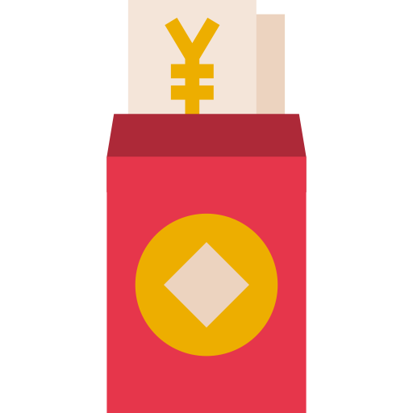

# TresV2

  

 

  

 

## 💬 **About the project**

Red Packet aims to gamify and make it easier to send gifts to their friends and family. It will also create a network effect and onboard the next billion people to web3 and blockchain. The code is built in solidity, hence it can be deployed to any EVM compatible blokchain.

## 🚀 **Onboarding**

You will need a Windows, Mac or Linux computer with command line access and permission to install new system packages. An active Internet connection is required to install the following required software:

- Node https://nodejs.org/en/
- NPM https://www.npmjs.com/

To initialize the project, using the terminal, navigate to the folder containing the project and run the `npm install` command. This will install all the necessary packages and prepare your project for local development.

To test with truffle you will need to install ganache-cli and run this command in the console: ganache-cli --allowUnlimitedContractSize  --gasLimit 0xFFFFFFFFFFFF -p 7545 --gasPrice 0 -m "magnet start enact blue sword soap bulk tip bright dolphin affair scout"

 

## 📄 **Smart Contracts Inventory**

| Contract          | Network | Testnet Address                            |
| :--------------------- | :------ | :----------------------------------------- |
| TresV2            | Binance    | [0x9Bd80766461d81393A1a31284f0282d427D6550B][bnb-url]      |

 

## 📓 **Additional Notes**

**Commit Standard**. The project aims to standardize commits as much as possible, therefore we invite you to use the [Conventional Commits](https://www.conventionalcommits.org/en/v1.0.0/) specification.

**NatSpec Standard**. Solidity Smart Contracts are documented following [NatSpec Format](https://docs.soliditylang.org/en/develop/natspec-format.html).
 

We have used the following frameworks:

* Truffle
* Ganache
* Solidity
* web3.js

 

## 💻 **Browser Support**

Currently, we aim to support the latest two versions of the following browsers:

    

[bnb-url]: https://testnet.bscscan.com/address/0x9Bd80766461d81393A1a31284f0282d427D6550B#code